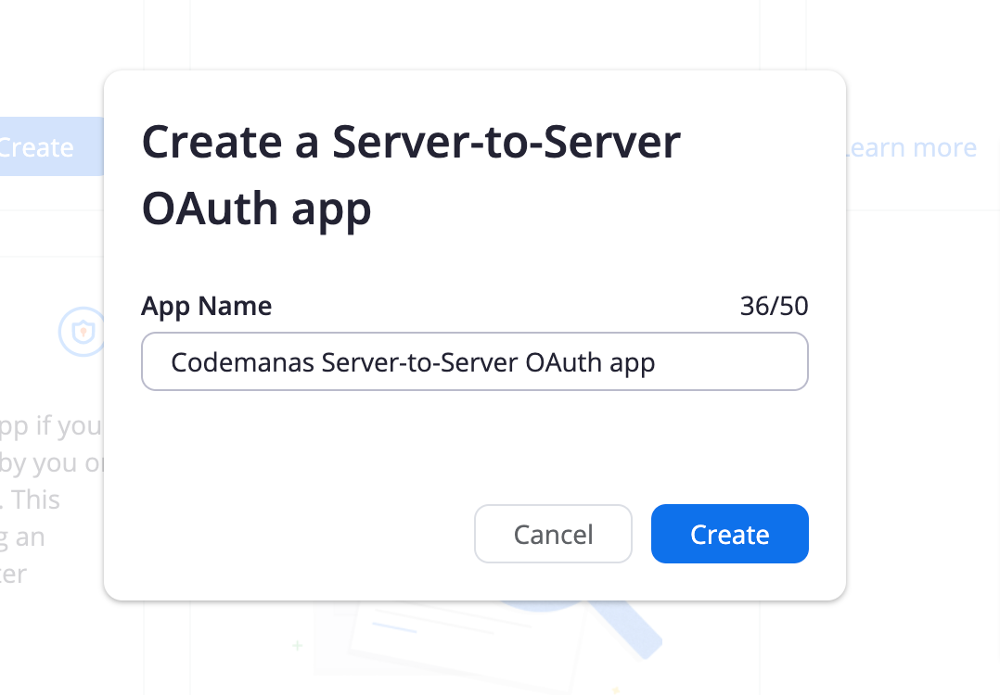
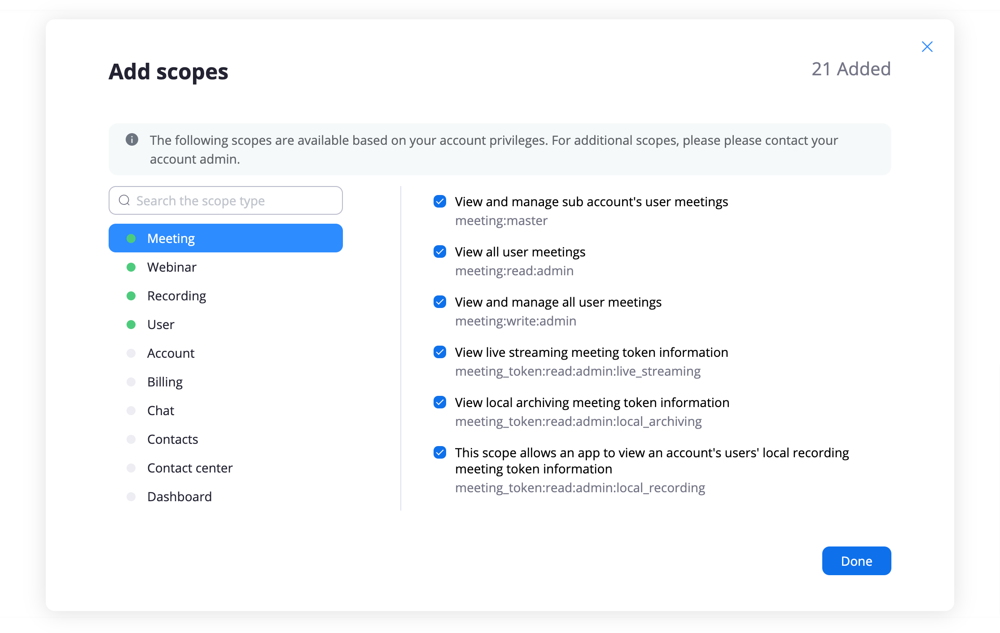
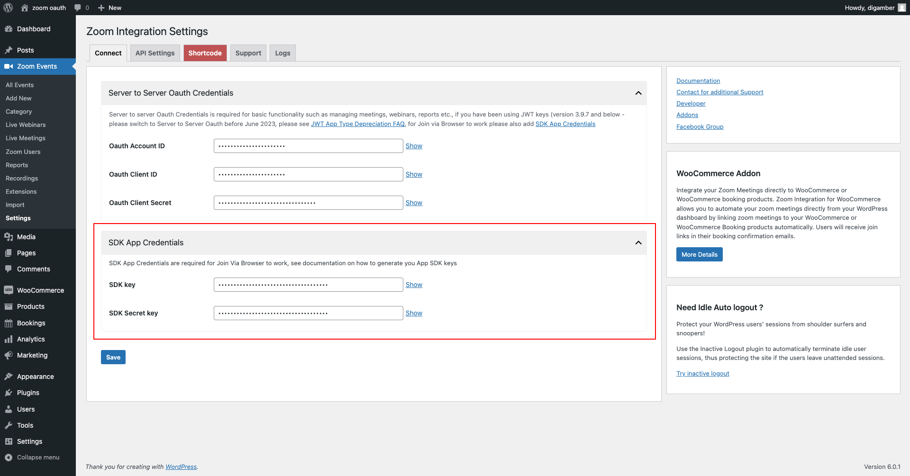

#Setup Video Conferencing with Zoom API

Here below are the steps to setup Zoom into WordPress.

From version 4.0.0 of Video Conferencing with Zoom API - the plugin has moved to Server-to-Server OAuth from JWT, this is because Zoom is deprecating JWT App type from June 2023,
For more info see [JWT App Type Depecation FAQ](https://marketplace.zoom.us/docs/guides/build/jwt-app/jwt-faq/), please see [migration guide](migration.md) to go to new Server-to-Server OAuth / App SDK

## Setup Server-to-Server OAuth
###Generating API Credentials:

For this plugin you will be using Server-to-Server OAuth app type.

1. First go to [Create Page](https://marketplace.zoom.us/develop/create)
2. Find Server-to-Server OAuth and click create 
3. Add your app name 
4. Once App is created - you will be taken to an App Overview page where you can see App Credentials 
5. You will need to add Contact name, Contact email and Company name on the information page 
6. For the plugin to work - you will need to define the correct scopes for the App. Go to scopes and click "Add Scopes" and add Meeting, Webinar, Report, User, Recording, Report and select all options on each selected scopes 

###Adding Server-to-Server OAuth Credentials to the plugin
1. Go to Zoom Events > Settings > Connect tab 
2. Add the Server-to-Server credentials ( Account ID, Client ID, Client Secret ) that can be viewed in the app under credentials (see step 4 above) 

##Setup App SDK Credentials
App SDK are required for Join via Browser/Web SDK to work properly.

###Generating App SDK Credentials
1. Go to [Create Page](https://marketplace.zoom.us/develop/create)
2. Find SDK and click create 
3. The next screen will prompt you for an App Name & ask you if you want to publish this app on Zoom App Marketplace. Add a name and toggle publish off 
4. Once App is created - you will need to add Company name, Name and Contact email 
5. Once the information has been added go to the App Credentials and you can view the SDK Credentials there 

###Adding SDK Credentials to the plugin
1. Go to Zoom Events > Settings > Connect tab 
2. Add SDK credentials ( SDK Key and SDK Secret ) 
3. To test out join via browser - you will need to create a meeting and test if join via browser is working properly
